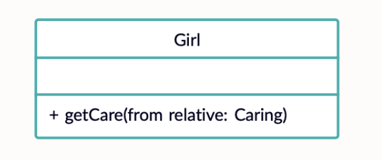
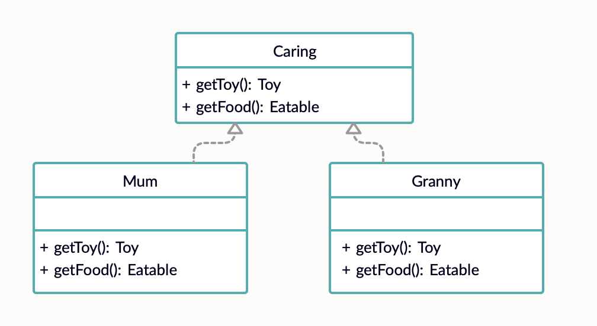
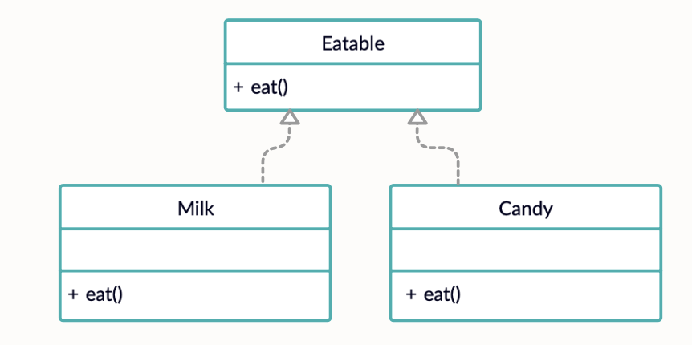

# **Абстрактная фабрика (Abstract Factory)**


### **Абстрактная фабрика** — это порождающий паттерн проектирования, который позволяет создавать семейства связанных объектов, не привязываясь к конкретным классам создаваемых объектов.

Следует использовать, когда необходимо делегировать другому классу создание множества взаимосвязанных объектов без привязки к конкретным классам


## Пример использования


**Диаграммы**








**Код**

```
class Girl {
    func getCare(from relative: Caring) {
        relative.getFood().eat()
        relative.getToy().play()
    }
}

protocol Eatable {
    func eat()
}

class Milk: Eatable {
    func eat() {
        print("Someone is drinking milk")
    }
}

class Candy: Eatable {
    func eat() {
        print("Someone eating candy")
    }
}

protocol Caring {
    func getToy() -> Toy
    func getFood() -> Eatable
}

class Mum: Caring {
    func getToy() -> Toy {
        return Ball()
    }
    
    func getFood() -> Eatable {
        return Milk()
    }
}

class Granny: Caring {
    func getToy() -> Toy {
        return Doll()
    }
    
    func getFood() -> Eatable {
        return Candy()
    }
}
```

## Ресурсы

* https://refactoring.guru/ru/design-patterns/abstract-factory
* https://refactoring.guru/ru/design-patterns/abstract-factory/swift/example
* https://www.youtube.com/watch?v=cmyUI_ZezoU
 
