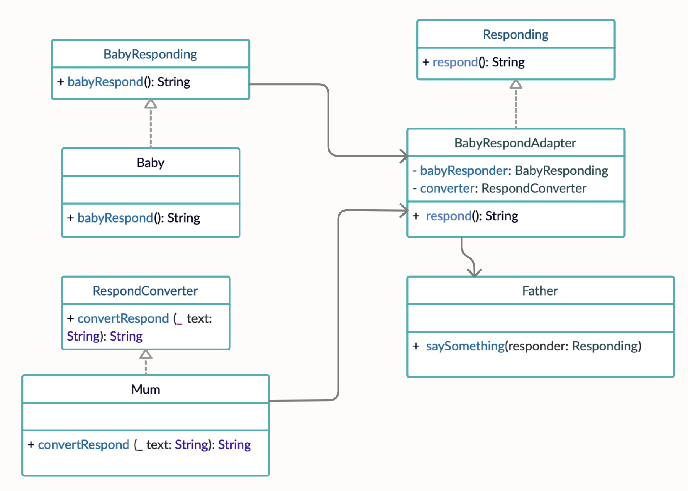

# **Адаптер (Adapter)**


### **Адаптер** — это структурный паттерн проектирования, который позволяет объектам с несовместимыми интерфейсами работать вместе.

Следует использовать, если необходимо преобразовать интерфейс одного класса в интерфейс другого класса, который требуется в работе.


## Пример использования


**Диаграммы**



**Код**

```
protocol BabyResponding {
    func babyRespond() -> String
}

class Baby: BabyResponding {
    func babyRespond() -> String {
        return "uA-uA-uA"
    }
}

protocol RespondConverter {
    func convertRespond(_ text: String) -> String
}

extension Mum: RespondConverter {
    func convertRespond(_ text: String) -> String {
        return "He said hi ;)"
    }
}

protocol Responding {
    func respond() -> String
}

class BabyRespondAdapter {
    init(babyResponder: BabyResponding, converter: RespondConverter) {
        self.babyResponder = babyResponder
        self.converter = converter
    }

    private let babyResponder: BabyResponding
    private let converter: RespondConverter
}

extension BabyRespondAdapter: Responding {
    func respond() -> String {
        return converter.convertRespond(babyResponder.babyRespond())
    }
}

extension Father {
    func saySomething(responder: Responding) {
        print(responder.respond())
    }
}
```

## Ресурсы

* https://refactoring.guru/ru/design-patterns/adapter
* https://refactoring.guru/ru/design-patterns/adapter/swift/example 
* https://lickability.com/blog/structural-design-patterns/#-the-adapter-pattern 
* https://www.youtube.com/watch?v=VunUuXyJw2U&t=319s 
 
