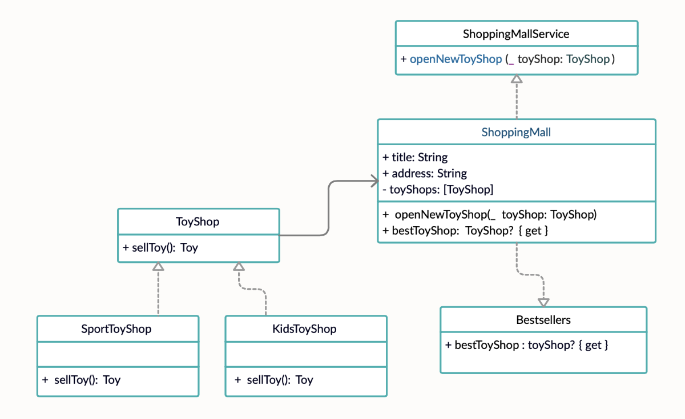

# **Мост (Bridge)**


### **Мост** — это структурный паттерн проектирования, который разделяет один или несколько классов на две отдельные иерархии — абстракцию и реализацию, позволяя изменять их независимо друг от друга.

Следует использовать, для получения преимуществ наследования без потери гибкости


## Пример использования


**Диаграммы**



**Код**

```
protocol ShoppingMallService {
    func openNewToyShop(_ toyShop: ToyShop)
}

class ShoppingMall {
    init(title: String, address: String) {
        self.title = title
        self.address = address
    }

    private let title: String
    private let address: String
    private var toyShops = [ToyShop]()
}

extension ShoppingMall: ShoppingMallService {
    func openNewToyShop(_ toyShop: ToyShop) {
        toyShops.append(toyShop)
    }
}

protocol Bestsellers {
    var bestToyShop: ToyShop? { get }
}

extension ShoppingMall: Bestsellers {
    var bestToyShop: ToyShop? {
        return toyShops.first
    }
}
```

## Ресурсы

* https://refactoring.guru/ru/design-patterns/bridge
* https://refactoring.guru/ru/design-patterns/bridge/swift/example#example-1
* https://www.youtube.com/watch?v=1KOkb-B2qnM
 
