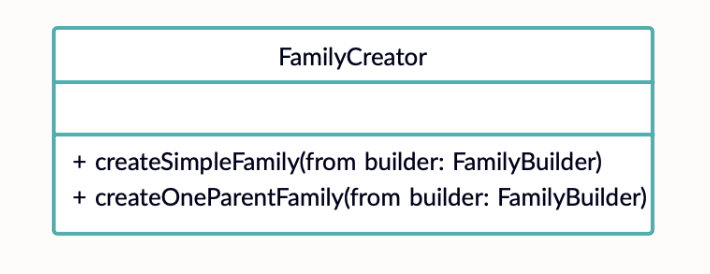
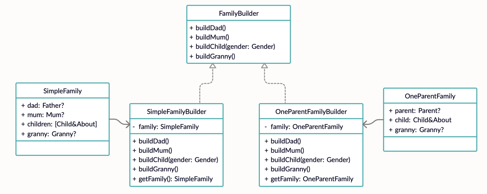

# **Строитель (Builder)**


### **Строитель** — это порождающий паттерн проектирования, который позволяет создавать сложные объекты пошагово. Строитель даёт возможность использовать один и тот же код строительства для получения разных представлений объектов.

Следует использовать, когда необходимо создавать различные объекты из одного набора данных


## Пример использования


**Диаграммы**






**Код**

```
enum Gender {
    case male
    case female
}

protocol FamilyBuilder {
    func buildDad()
    func buildMum()
    func buildChild(gender: Gender)
    func buildGranny()
}

class SimpleFamily {
    var dad: Father?
    var mum: Mum?
    var children = [Child & About]()
    var granny: Granny?
}

class SimpleFamilyBuilder: FamilyBuilder {
    func buildDad() {
        family.dad = Father()
    }

    func buildMum() {
        family.mum = Mum()
    }

    func buildChild(gender: Gender) {
        switch gender {
        case .male:
            family.children.append(Boy())
        case .female:
            family.children.append(Girl())
        }
    }

    func buildGranny() {
        family.granny = Granny()
    }

    func getFamily() -> SimpleFamily {
        return family
    }
    
    private let family = SimpleFamily()
}

class OneParentFamily {
    var parent: (Parent & About)?
    var child: (Child & About)?
    var granny: Granny?
}

class OneParentFamilyBuilder: FamilyBuilder {
    func buildDad() {
        if family.parent == nil {
            family.parent = Father()
        }
    }
    
    func buildMum() {
        if family.parent == nil {
            family.parent = Mum()
        }
    }
    
    func buildChild(gender: Gender) {
        switch gender {
        case .male:
            family.child = Boy()
        case .female:
            family.child = Girl()
        }
    }
    
    func buildGranny() {
        family.granny = Granny()
    }
    
    func getFamily() -> OneParentFamily {
        return family
    }

    private let family = OneParentFamily()
}

class FamilyCreator {
    func createSimpleFamily(from builder: FamilyBuilder) {
        builder.buildDad()
        builder.buildMum()
        builder.buildChild(gender: .male)
    }

    func createOneParentFamily(from builder: FamilyBuilder) {
        builder.buildDad()
        builder.buildChild(gender: .female)
        builder.buildGranny()
    }
}
```

## Ресурсы

* https://refactoring.guru/ru/design-patterns/builder 
* https://refactoring.guru/ru/design-patterns/builder/swift/example#example-0 
* https://www.youtube.com/watch?v=63_ExLjusac
 
