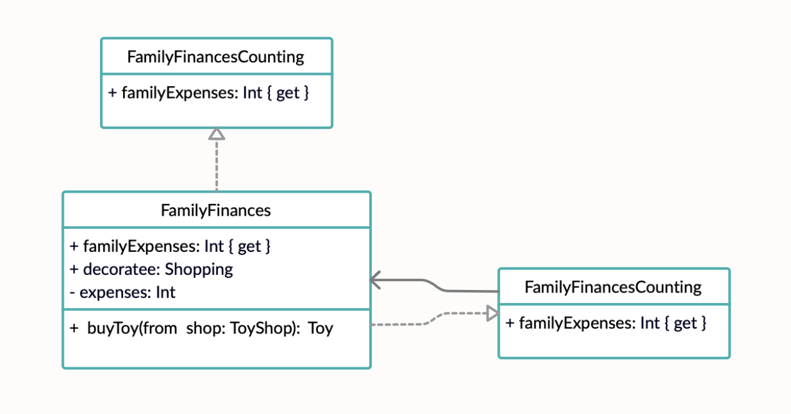

# **Декоратор (Decorator)**


### **Декоратор** — это структурный паттерн проектирования, который позволяет динамически добавлять объектам новую функциональность.

Следует использовать, если необходимо избежать порождение подклассов для расширения функциональности.


## Пример использования


**Диаграммы**



**Код**

```
protocol FamilyFinancesCounting {
    var familyExpenses: Int { get }
}

class FamilyFinances: FamilyFinancesCounting {
    var familyExpenses: Int { expenses }

    init(decoratee: Shopping) {
        self.decoratee = decoratee
    }

    private let decoratee: Shopping
    private var expenses = 0
}

extension FamilyFinances: Shopping {
    func buyToy(from shop: ToyShop) -> Toy {
        let toy = decoratee.buyToy(from: shop)

        expenses += toy.cost

        return toy
    }
}
```

## Ресурсы

* https://refactoring.guru/ru/design-patterns/decorator
* https://refactoring.guru/ru/design-patterns/decorator/swift/example
* https://lickability.com/blog/structural-design-patterns/#-the-decorator-pattern
* https://www.youtube.com/watch?v=2aB2B3b3bQA
 
