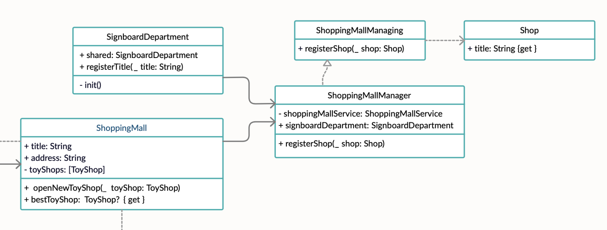

# **Фасад (Facade)**


### **Фасад** — это структурный паттерн проектирования, который предоставляет простой интерфейс к сложной системе классов, библиотеке или фреймворку.

Следует использовать, для определения интерфейса высокого уровня, который упрощает использование подсистем.


## Пример использования


**Диаграммы**



**Код**

```
protocol Shop {
    var title: String { get }
}

protocol ShoppingMallManaging {
    func registerShop(_ shop: Shop)
}

class ShoppingMallManager: ShoppingMallManaging {
    let signboardDepartment = SignboardDepartment.shared

    init(shoppingMallService: ShoppingMallService) {
        self.shoppingMallService = shoppingMallService
    }

    func registerShop(_ shop: Shop) {
        signboardDepartment.registerTitle(shop.title)

        if let toyShop = shop as? ToyShop {
            shoppingMallService.openNewToyShop(toyShop)
        }
    }

    private let shoppingMallService: ShoppingMallService
}

class SignboardDepartment {
    static let shared = SignboardDepartment()

    func registerTitle(_ title: String) {
        signboards.append(title)
    }

    private init() {
    }

    private (set) var signboards = [String]()
}
```

## Ресурсы

* https://refactoring.guru/ru/design-patterns/facade
* https://refactoring.guru/ru/design-patterns/facade/swift/example
* https://lickability.com/blog/structural-design-patterns/#--the-facade-pattern
* https://www.youtube.com/watch?v=7thoI-_K9EU
 
