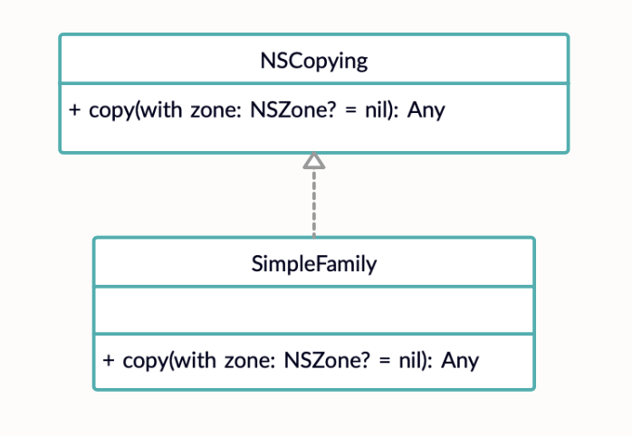

# **Прототип (Prototype)**


### **Прототип** — это порождающий паттерн проектирования, который позволяет копировать объекты, не вдаваясь в подробности их реализации.

Следует использовать, когда необходимо создать копию объекта в каком-то состоянии.


## Пример использования


**Диаграммы**



**Код**

```
extension SimpleFamily: NSCopying {
    func copy(with zone: NSZone? = nil) -> Any {
        return type(of: self).init(
                        dad: dad, 
                        mum: mum, 
                        children: children, 
                        granny: granny)
    }
}
```

## Ресурсы

* https://refactoring.guru/ru/design-patterns/prototype 
* https://refactoring.guru/ru/design-patterns/prototype/swift/example
* https://lickability.com/blog/understanding-creational-design-patterns/#-the-prototype-pattern  
* https://www.youtube.com/watch?v=7X3eQZX5b9Y 


