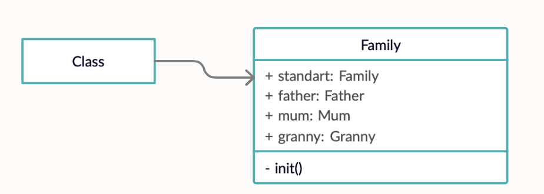

# **Одиночка (Singleton)**


### **Одиночка** — это порождающий паттерн проектирования, который гарантирует, что у класса есть только один экземпляр, и предоставляет к нему глобальную точку доступа.

Следует использовать для создания единственного экземпляра некоторого класса для всего проекта


## Пример использования


**Диаграммы**




**Код**

```
Family.standart.father.buyToy(from: KidsToyShop()).play()        
Family.standart.mum.sayHello()

class Family {
    static let standart = Family()

    let father = Father()
    let mum = Mum()
    let granny = Granny()

    private init() {
    }
}
```

## Ресурсы

* https://refactoring.guru/ru/design-patterns/singleton
* https://refactoring.guru/ru/design-patterns/singleton/swift/example
* https://lickability.com/blog/understanding-creational-design-patterns/#1%EF%B8%8F⃣-the-singleton-pattern 
* https://www.youtube.com/watch?v=vyr9GO7dLBQ&t=186s 
 
